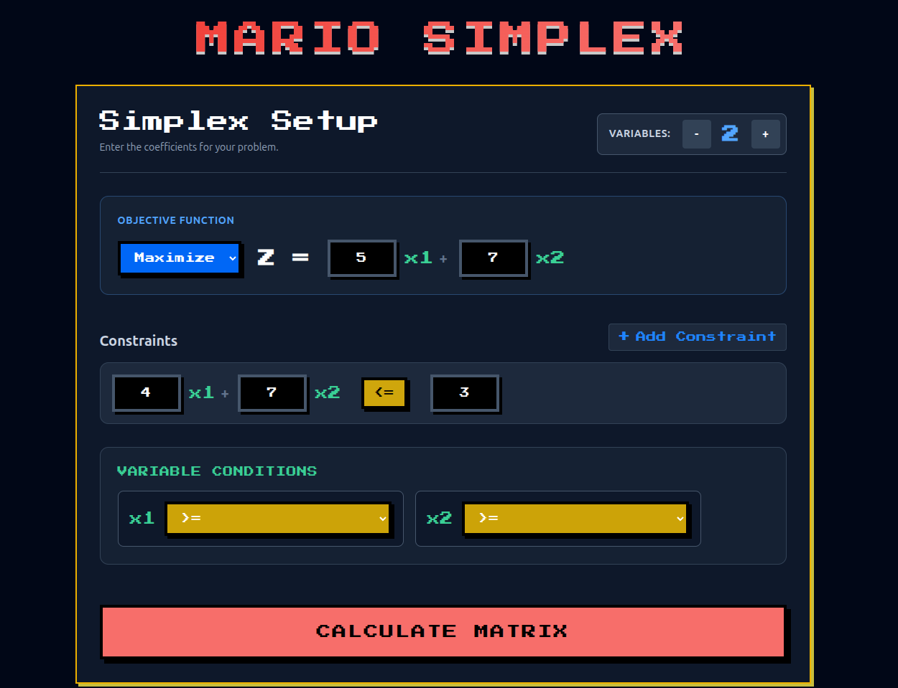
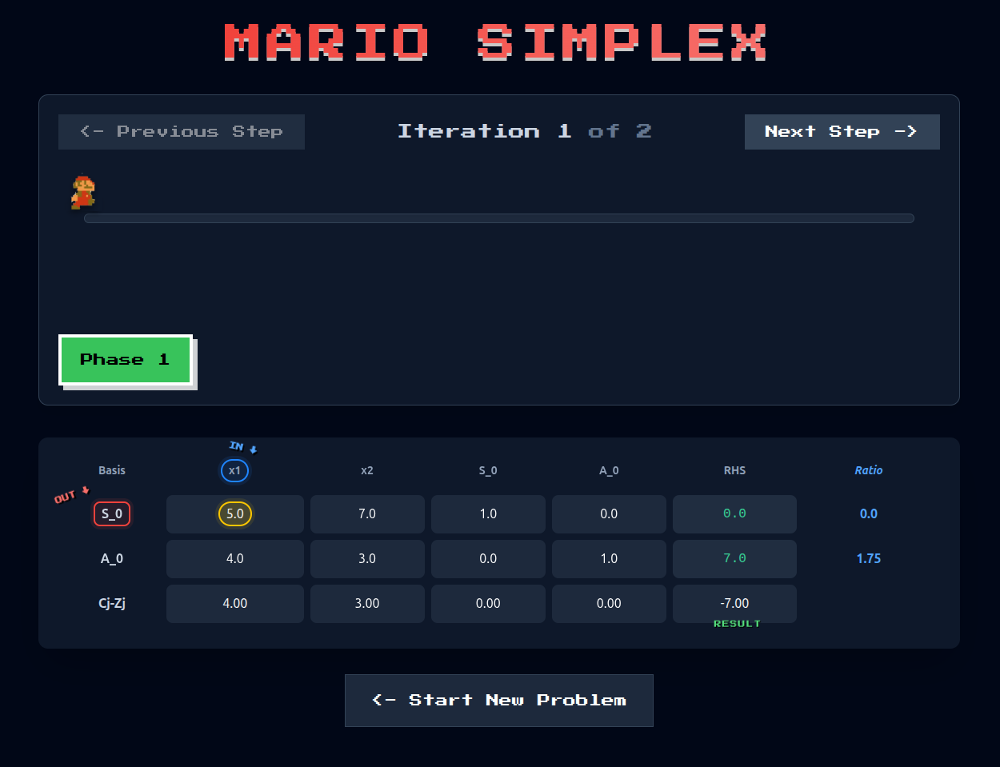

# 🍄 Mario Simplex Solver 
### *Enterprise-Grade Optimization with Gamified UX*


---

## 📝 Project Overview
The **Mario Simplex Solver** is a high-performance computational tool 
designed to resolve complex Linear Programming (LP) problems. By 
implementing both **Standard** and **Two-Phase Simplex** algorithms, 
the engine handles diverse constraint types and variable restrictions.

This project bridges the gap between rigorous mathematics and 
user-centric design. By wrapping a mathematical core in a gamified 
Mario-themed interface, we leverage **HCI principles** to make 
optimization logic more accessible and engaging.

---

## 📸 Visual Documentation

### 🏰 Optimization Dashboard
The command center for model definition. It features a custom expression 
parser that translates string-based constraints into computational matrices.

<div align="center">
  
  <p><i>Figure 1: Description of the image here</i></p>
</div>

### 🍄 Iterative Tableau Visualization
Transparency is key. The solver renders every iteration of the 
Gauss-Jordan elimination with real-time feedback on pivot selections.

<div align="center">
  
  <p><i>Figure 2: Matrix updates with pivot column/row highlighting.</i></p>
</div>

---

## ⚙️ Core Technical Capabilities

### 1. Mathematical Rigor
* **Two-Phase Method**: Invoked for $\ge$ or $=$ constraints.
* **Standard Form Conversion**: Handles slack, surplus, and artificial variables.
* **Variable Transformation**: Resolves **unrestricted variables** via the 
substitution $x_j = x_j' - x_j''$, maintaining non-negativity constraints.

### 2. Algorithmic Diagnostics
* **Optimality**: Reached when $C_j - Z_j \le 0$ (for maximization).
* **Infeasibility**: Detected via Phase I artificial variable analysis.
* **Unboundedness**: Identified during the minimum ratio test.
* **Degeneracy**: Handled via specific pivot selection logic.

---

## 🏗 System Architecture

The application follows a **Decoupled Client-Server Architecture**:

* **Backend (Spring Boot)**: Uses the **Strategy Pattern** for 
solver selection and **Regex** for high-speed expression parsing.
* **Frontend (Angular)**: A reactive, component-based UI using 
**RxJS** for asynchronous state management and **custom CSS** for the thematic Mario experience.

---

## 🚀 Installation & Deployment

### 1. Backend Setup (Spring Boot)
```bash
# Build the project
mvn clean install

# Run the application
mvn spring-boot:run

# Install dependencies
npm install

# Start the server
ng serve
```

---

## 📖 Operational User Guide

1.  **Define Objective**: Toggle **Max/Min** and input your coefficients.
2.  **Add Constraints**: Use `>=`, `<=`, or `=` operators.
3.  **Handle Restrictions**: Use `x_n == 0` for unrestricted variables.
4.  **Execute**: Click **Solve** and navigate iterations using the UI.
    * **Green**: Entering Variable.
    * **Red/Yellow**: Leaving Variable.


---
*Developed for Alexandria University, Faculty of Engineering - CSED 2028.*
